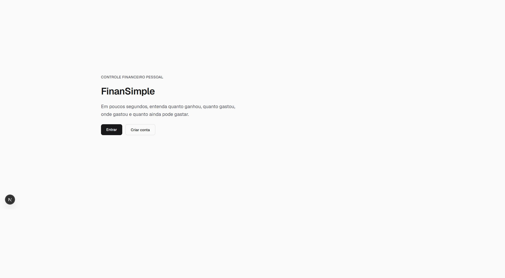
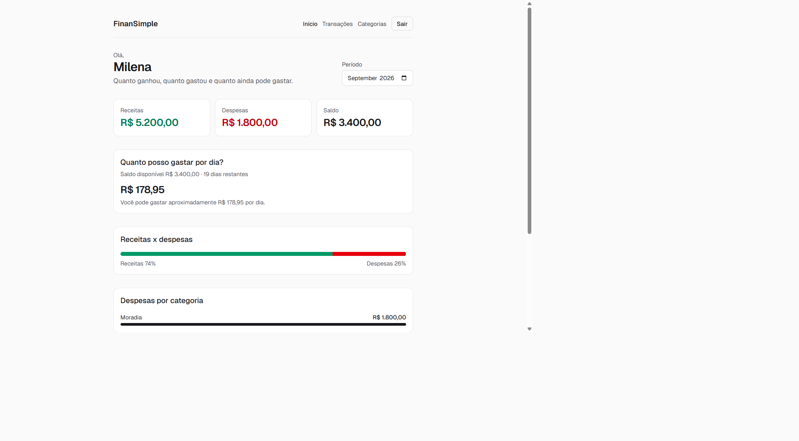
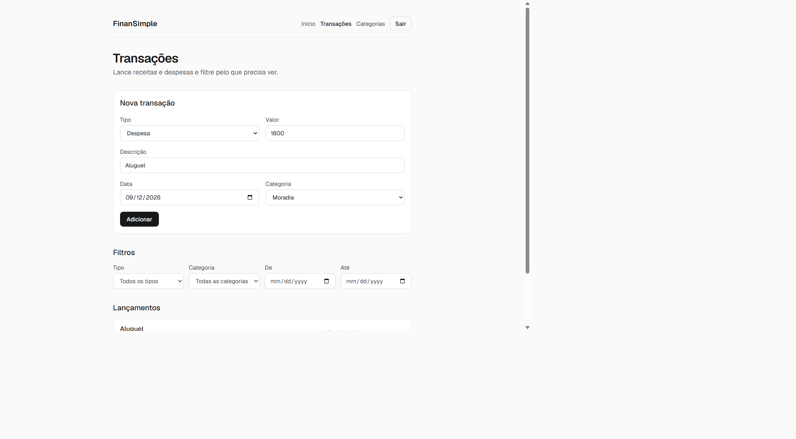

# FinanSimple

[](https://github.com/milena-brito/ControleFinanceiro/actions/workflows/ci.yml)

Aplicação full stack de controle financeiro pessoal, focada em simplicidade.

> Em poucos segundos, o usuário consegue entender quanto ganhou, quanto gastou, onde gastou e quanto ainda pode gastar.

Este é um projeto de portfólio desenvolvido com preocupação em qualidade de software: TypeScript estrito, responsabilidades separadas entre frontend e backend, testes na API, e evolução incremental por etapas.

## Problema

Planilhas e apps genéricos exigem tempo demais para responder a pergunta do dia a dia: **posso gastar hoje?** O FinanSimple reduz isso a um resumo mensal e a um valor diário.

## Solução

O usuário cria uma conta, lança receitas e despesas com categorias, e vê no início do mês:

- quanto entrou, quanto saiu e o saldo
- despesas agrupadas por categoria
- quanto ainda pode gastar por dia (saldo disponível ÷ dias restantes)

## Funcionalidades

- Cadastro, login e sessão em cookie `httpOnly`
- CRUD de transações (receita/despesa) com filtros
- Categorias padrão + categorias próprias
- Dashboard do mês com barras de participação
- Cálculo de gasto diário
- Interface responsiva em português

## Screenshots







## Tecnologias

| Camada   | Tecnologia                               |
| -------- | ---------------------------------------- |
| Frontend | Next.js, React, TypeScript, Tailwind CSS |
| Backend  | NestJS, Node.js, TypeScript              |
| Banco    | PostgreSQL + Prisma                      |
| Testes   | Vitest (backend)                         |
| Pacotes  | npm workspaces                           |
| Entrega  | Docker Compose e GitHub Actions          |

## Arquitetura

```
Navegador (Next.js :3000)
        HTTP REST + cookie httpOnly
API (NestJS :3001)
        Prisma
PostgreSQL
```

O frontend não acessa o banco. A API é a única origem da verdade. Em produção, CORS fica restrito a `FRONTEND_ORIGIN`.

## Estrutura

```
/
  frontend/              # Next.js (porta 3000)
  backend/               # NestJS API REST (porta 3001)
  backend/prisma/        # Schema, migrations e seed
  docker-compose.yml     # PostgreSQL, API e frontend (perfil app)
  .github/workflows/     # CI: lint, typecheck, testes e build
```

## Pré-requisitos

- Node.js 20.9 ou superior (veja `.nvmrc`)
- npm 10+
- Docker Desktop (PostgreSQL local; opcionalmente a API e o frontend)

## Como executar localmente

Não existe usuário de demonstração: o seed só cria categorias padrão. No primeiro uso, crie uma conta em `/cadastro`.

1. Copie as variáveis de ambiente.

Git Bash / macOS / Linux:

```bash
cp .env.example .env
cp .env.example backend/.env
```

PowerShell:

```powershell
Copy-Item .env.example .env
Copy-Item .env.example backend/.env
```

2. Instale as dependências na raiz:

```bash
npm install
```

3. Suba o PostgreSQL e aplique as migrations:

```bash
npm run db:up
npm run db:migrate
npm run db:seed
```

O `prisma migrate` lê `backend/.env`. Use o mesmo `DATABASE_URL` do [`.env.example`](.env.example).

4. Em um terminal, suba a API:

```bash
npm run dev:backend
```

5. Em outro terminal, suba o frontend:

```bash
npm run dev:frontend
```

- Frontend: [http://localhost:3000](http://localhost:3000)
- Cadastro: [http://localhost:3000/cadastro](http://localhost:3000/cadastro)
- Login: [http://localhost:3000/login](http://localhost:3000/login)
- Início: [http://localhost:3000/inicio](http://localhost:3000/inicio)
- Transações: [http://localhost:3000/transacoes](http://localhost:3000/transacoes)
- Categorias: [http://localhost:3000/categorias](http://localhost:3000/categorias)
- Saúde da API: [http://localhost:3001/health](http://localhost:3001/health)

## Rodar tudo no Docker

Para subir PostgreSQL, API e frontend juntos:

```bash
npm run docker:up
```

A primeira subida espera o Postgres ficar saudável, aplica migrations e o seed, e só então o frontend sobe.

- Frontend: [http://localhost:3000](http://localhost:3000)
- API: [http://localhost:3001](http://localhost:3001)

O `JWT_SECRET` do Compose serve só para uso local. Isso **não** é um ambiente de produção.

Para parar:

```bash
npm run docker:down
```

O fluxo com Node na máquina (`npm run dev:frontend` / `npm run dev:backend`) continua igual: `npm run db:up` sobe **só** o PostgreSQL.

## Variáveis de ambiente

Veja [`.env.example`](.env.example). Não coloque secrets no código.

| Variável              | Onde     | Função                        |
| --------------------- | -------- | ----------------------------- |
| `NEXT_PUBLIC_API_URL` | frontend | URL da API                    |
| `FRONTEND_ORIGIN`     | backend  | Origem permitida no CORS      |
| `PORT`                | backend  | Porta da API (padrão 3001)    |
| `NODE_ENV`            | backend  | `development` ou `production` |
| `JWT_SECRET`          | backend  | Assinatura do token de sessão |
| `DATABASE_URL`        | backend  | Conexão PostgreSQL (Prisma)   |

Em produção, `JWT_SECRET` e `FRONTEND_ORIGIN` são obrigatórios. Não use os valores de exemplo.

## Testes

Na raiz:

```bash
npm test
```

Testes e2e da API (Prisma substituído por stub; não usam PostgreSQL):

```bash
npm run test:e2e
```

Também: `npm run lint`, `npm run typecheck` e `npm run build`.

## CI

Pull requests e pushes em `develop` e `main` disparam o GitHub Actions: lint, typecheck, testes unitários, e2e e build. Não há deploy automático.

## Segurança

A API aplica cabeçalhos HTTP com Helmet, CORS restrito a `FRONTEND_ORIGIN` e cookie de sessão `httpOnly`. Login e cadastro têm limite de tentativas por IP. Erros internos não devolvem stack nem detalhes do banco; falha de conexão vira 503 com mensagem amigável.

O `npm audit` ainda aponta avisos no Prisma 6 (`deepmerge-ts`) e no `qs` do Express. Não foram forçadas atualizações que quebrariam o Nest 12.

## Decisões técnicas

- **Monorepo npm workspaces** — frontend e backend no mesmo repositório, scripts na raiz.
- **Cookie `httpOnly`** — a sessão não fica no `localStorage`.
- **Prisma 6** — o Nest 12 deste projeto não usa Prisma 7.
- **Imagem do frontend em Debian slim** — bindings nativos do Tailwind falham em Alpine/musl.
- **CI no GitHub Actions** — qualidade em todo PR; deploy fica fora do escopo.

## Git

O desenvolvimento acontece em branches de feature, a partir de `develop`. `main` recebe apenas versões estáveis.

## Roadmap

Etapas entregues:

1. Inicialização do projeto
2. Banco de dados
3. Autenticação
4. Transações
5. Categorias
6. Dashboard
7. Cálculo de gasto diário
8. Testes
9. Segurança
10. Docker
11. CI/CD
12. Polimento final

Possíveis melhorias futuras:

- Paginação na lista de transações
- Período customizado no dashboard
- Testes no frontend
- Deploy em nuvem
